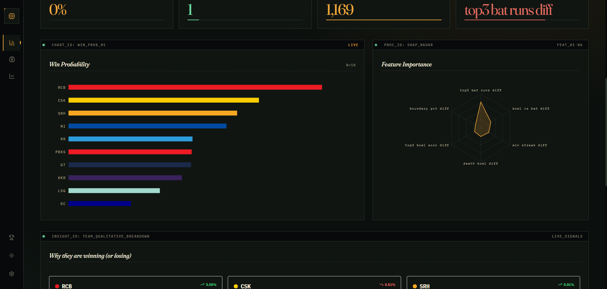
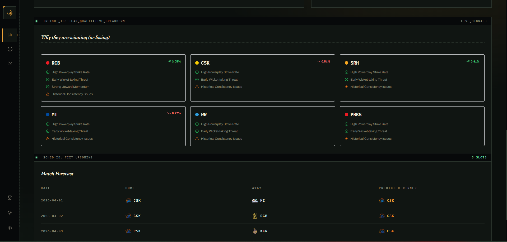
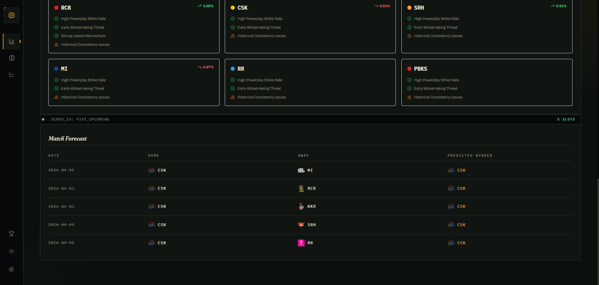

# IPL Winner Prediction System

### Temporal ML · Dynamic Modeling · Probability-Based Forecasting

---

## Project Overview
This is a technical implementation of a dynamic machine learning system designed to model team strength and simulate IPL 2026 outcomes. The project focuses on **Strict Temporal Feature Engineering** to eliminate data leakage and captures the high-scoring, volatile trends of the modern "Impact Player" era.

### UI Previews

*Win Probability Distribution across the 2026 tournament cycle.*


*Explaining the "Why" behind team rankings via heuristic signaling.*


*Upcoming match predictions and venue-specific win probabilities.*

### Core Methodology
- **Temporal Feature Engineering**: Models are trained on chronological snapshots, ensuring features like "team form" only use data available before the match date.
- **Ball-by-Ball Analytics**: Derives granular signals (Powerplay SR, Death Over Economy, Boundary Percentage) to track evolving team performance.
- **Probabilistic Forecasting**: Uses a calibrated XGBoost model to estimate win probabilities, followed by a 5,000-iteration Monte Carlo simulation of the tournament structure.
- **Model-Informed Insights**: Generates qualitative justifications for rankings by surfacing the underlying performance metrics (heuristics) driving the model's output.

---

## Technical Architecture
- **Dynamic Ingestion Pipeline**: Processes raw Cricsheet JSON data (currently synced up to April 23, 2026).
- **Heuristic Confidence Scoring**: Confidence levels (High/Medium/Low) are derived from probability separation and model certainty thresholds.
- **Trend Modeling**: Tracks shifts in tournament win probability across data snapshots to reflect current momentum.
- **Calibrated Estimates**: Employs Isotonic regression to ensure model probabilities correspond to real-world outcomes.

---

## Performance & Accuracy
- **Model Stability**: Maintains ~56–60% accuracy on the 2024/2026 seasons (which are historically stochastic due to record-breaking scores).
- **Net Gain**: **+6.7%** improvement over the baseline (momentum-only) model.
- **Signal Discovery**: Successfully surfaces the critical impact of "Powerplay Wickets" and "Death Over Efficiency" in the 2026 meta.

---

## Quick Start
```bash
# 1. Setup Environment
pip install -r requirements.txt

# 2. Re-ingest and Engineer Features
python main.py --mode setup

# 3. Generate 2026 Predictions
python main.py --mode predict
```

---

## Live Snapshots (As of April 23, 2026)
| Rank | Team | Win Prob | Trend | Confidence | Key Signal |
| :--- | :--- | :--- | :--- | :--- | :--- |
| 1 | **RCB** | 17.70% | +3.05% | High | High Powerplay Strike Rate |
| 2 | **CSK** | 13.74% | -0.51% | Medium | Disciplined Death Bowling |
| 3 | **SRH** | 12.05% | +0.91% | Medium | Early Wicket-taking Threat |

> **Last Updated**: April 23, 2026  
> **Data Coverage**: Matches till April 23, 2026  
> **Method**: Temporal XGBoost + MC Simulation  

---

## Important Considerations
This system is a research project designed to demonstrate advanced ML engineering patterns. Cricket is a stochastic sport with high variance; these predictions represent probabilistic estimates based on historical patterns and should not be treated as deterministic certainties.

---
*Created by [toxicbishop] — ML Engineering Portfolio*
