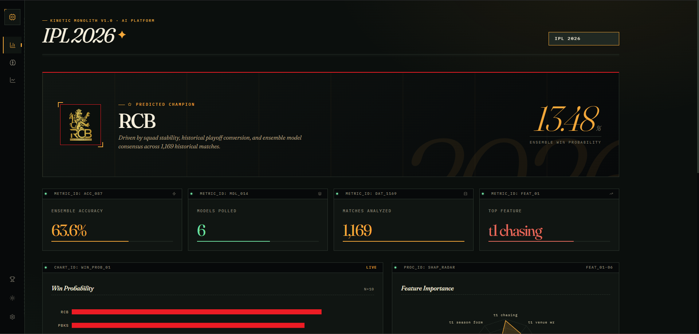

# IPL 2026 Winner Prediction



A complete machine learning pipeline to predict IPL 2026 outcomes using real ball-by-ball IPL data.

The project supports two prediction modes:

- Tournament winner probabilities (all 10 teams)
- Match-by-match fixture predictions for the full 2026 schedule

## IPL 2026 Prediction Snapshot

### IPL 2026 Winner Ranking

| Rank | Team                        | Win Probability |
| ---- | --------------------------- | --------------- |
| 1    | Royal Challengers Bengaluru | 13.48%          |
| 2    | Punjab Kings                | 12.56%          |
| 3    | Gujarat Titans              | 11.77%          |
| 4    | Mumbai Indians              | 10.64%          |
| 5    | Rajasthan Royals            | 10.05%          |
| 6    | Sunrisers Hyderabad         | 9.45%           |
| 7    | Lucknow Super Giants        | 9.04%           |
| 8    | Chennai Super Kings         | 8.26%           |
| 9    | Delhi Capitals              | 7.91%           |
| 10   | Kolkata Knight Riders       | 6.83%           |

The probability blends four priors — squad strength (roster-aware, aggregated from each projected 2026 XI's per-player career form), 3-year playoff rate, 2025 rank score, and model signal — with an in-season form prior whose weight ramps linearly from 0 to 30% over the first 30 matches of the 2026 season. At the time of this snapshot, 23 matches had been played and the in-season signal carried ~23% weight. RCB's lead comes from strong early-season form (4 wins in 5 games) on top of the 2025 priors.

Sources: `outputs/results/ipl/prediction_2026.json`, `src/features/player_form.py`, `src/features/in_season_form.py`, `data/rosters_2026.json`.

### Fixture-level Summary (2026 Schedule)

Predicted league-stage wins from `outputs/results/ipl/ipl_2026_match_predictions.csv`:

- GT: 9
- MI: 8
- PBKS: 7
- DC: 5
- SRH: 5
- RCB: 4
- LSG: 3
- CSK: 2
- KKR: 1
- RR: 1

### Daily In-Season Refresh

After each match day, run:

```bash
python scripts/update_in_season.py
```

This pulls the latest Cricsheet archive, rebuilds the ball-by-ball CSV + priors + rosters, retrains all models, and regenerates both the winner ranking and fixture predictions. The in-season form signal is recomputed from the updated `data/processed/ipl/matches.csv`, so predictions stay current through the season.

## ICC Men's T20 World Cup 2026 — Top Contenders

| Rank | Team         | Win Probability |
| ---- | ------------ | --------------- |
| 1    | West Indies  | 94.96%          |
| 2    | England      | 88.20%          |
| 3    | India        | 83.06%          |
| 4    | New Zealand  | 79.44%          |
| 5    | Pakistan     | 78.60%          |
| 6    | Australia    | 75.84%          |
| 7    | South Africa | 74.22%          |
| 8    | Scotland     | 60.65%          |

Full 23-team ranking: `outputs/results/icc_men/prediction_2026.json`.

## ICC Women's T20 World Cup 2026

| Rank | Team         | Win Probability |
| ---- | ------------ | --------------- |
| 1    | Australia    | 90.82%          |
| 2    | England      | 90.10%          |
| 3    | South Africa | 72.92%          |
| 4    | India        | 58.22%          |
| 5    | New Zealand  | 54.33%          |
| 6    | Sri Lanka    | 39.19%          |
| 7    | Bangladesh   | 20.13%          |
| 8    | West Indies  | 19.86%          |
| 9    | Pakistan     | 4.43%           |

Source: `outputs/results/icc_women/prediction_2026.json`.

**Note on ICC probabilities**: Unlike the IPL numbers, ICC win probabilities are raw classifier outputs for each team's head-to-head matchup strength, not normalized tournament-winner probabilities — they do not sum to 100%. Read them as relative strength signals, not literal tournament-winning odds. Bringing ICC tournaments onto the same Bayesian + in-season pipeline as IPL is tracked as future work.

## Model Performance (IPL)

| Model          | CV Accuracy | Test Accuracy | Test AUC |
| -------------- | ----------- | ------------- | -------- |
| Random Forest  | 0.6604      | 0.6450        | 0.7046   |
| XGBoost        | 0.6566      | 0.6190        | 0.7110   |
| LightGBM       | 0.6508      | 0.6580        | 0.7084   |
| Neural Network | 0.6287      | 0.6190        | 0.6504   |
| ExtraTrees     | 0.6566      | 0.6104        | 0.6833   |
| Ensemble       | -           | 0.6364        | 0.7007   |

Source: `outputs/results/ipl/model_results.json`

## Data

Primary training source:

- `data/raw_datasets/ipl/` (Cricsheet JSON files)
- `data/raw_datasets/icc_men/`
- `data/raw_datasets/icc_women/`

Generated pipeline artifacts:

- `data/raw/matches.csv`
- `data/raw/player_stats.csv`
- `data/raw/teams.json`
- `data/processed/matches_processed.csv`
- `data/processed/features.csv`
- `data/db/ipl.db`

2026 fixture input:

- (Generated dynamically) Legacy input at `data/mock/ipl-2026-UTC.csv`

2026 priors and rosters:

- `data/priors_2026.json` — `playoff_rate_3yr` and `season_2025_rank_score` auto-computed from Cricsheet; `squad_strength_2026` is hand-curated.
- `data/rosters_2026.json` — projected 2026 XI per team (top-15 by 2025 Cricsheet appearances, hand-editable post-auction).

## Project Structure

```
IPL-Winner-Prediction-2026/
├── config.py
├── main.py
├── server.py
├── Public/           (Assets and Screenshots)
│   └── assets/
├── data/
│   ├── raw_datasets/ (Cricsheet JSONs)
│   │   ├── ipl
│   │   ├── icc_men
│   │   └── icc_women
│   ├── mock/         (Dummy datasets and legacy fixtures)
│   ├── raw/          (Parsed raw stats CSVs)
│   ├── processed/    (Engineered feature CSVs)
│   └── db/           (SQLite caching)
├── src/
│   ├── data/
│   ├── features/
│   ├── models/
│   └── prediction/
├── dashboard/        (UI Frontend)
├── scripts/          (CRON jobs and rebuilds)
├── outputs/
│   ├── models/
│   └── results/
├── notebooks/
└── requirements.txt
```

## Setup

```bash
pip install -r requirements.txt
```

## Run Pipeline

```bash
python main.py --mode setup
python main.py --mode train
python main.py --mode predict
python main.py --mode visualize
```

Or run all in one command:

```bash
python main.py --mode all
```

## Generate Match-by-Match Predictions (2026 schedule)

Input file must exist at `data/mock/ipl-2026-UTC.csv`.

Output file:

- `outputs/results/ipl/ipl_2026_match_predictions.csv`

## Output Visualizations

Generated in `outputs/results/ipl/`:

- `win_probability.png`
- `model_comparison.png`
- `historical_win_rates.png`

## License

This project is licensed under the MIT License - see the [LICENSE](LICENSE) file for details.
